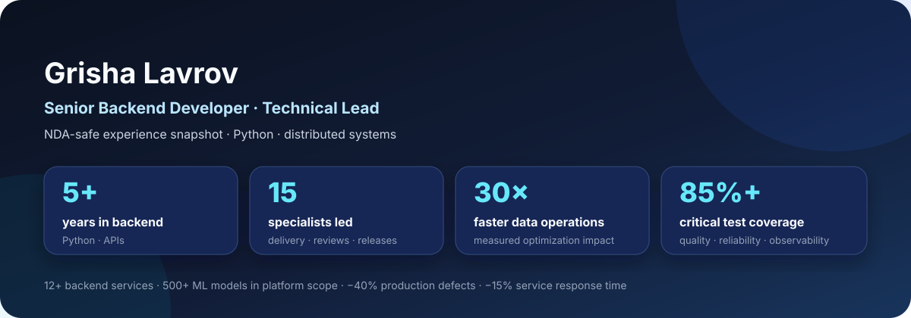
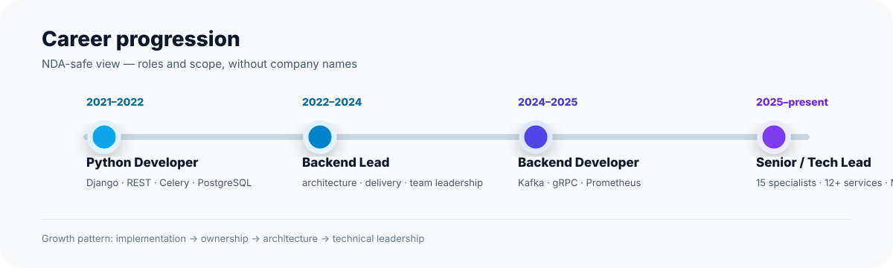
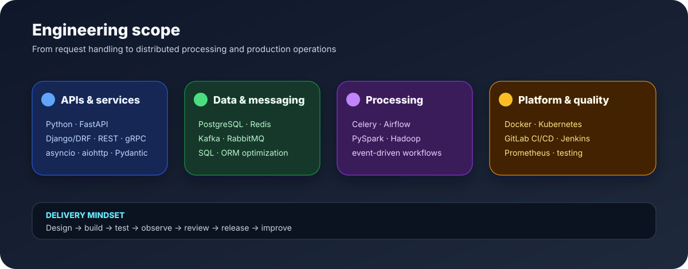

# Hi, I'm Grisha Lavrov 👋

### Senior Backend Developer · Technical Lead

I design and build backend systems for data-intensive products, internal platforms, and distributed workflows. My focus is Python, API design, event-driven architecture, performance, reliability, and technical leadership.

  

## ⚡ At a glance

<table width="100%">
  <tr>
    <td align="center" width="25%"><h3>5+</h3>years in backend</td>
    <td align="center" width="25%"><h3>15</h3>specialists led</td>
    <td align="center" width="25%"><h3>12+</h3>backend services</td>
    <td align="center" width="25%"><h3>500+</h3>ML models in scope</td>
  </tr>
  <tr>
    <td align="center"><h3>30×</h3>faster data operations</td>
    <td align="center"><h3>85%+</h3>critical test coverage</td>
    <td align="center"><h3>−40%</h3>production defects</td>
    <td align="center"><h3>−15%</h3>service response time</td>
  </tr>
</table>

### Measured impact

- Led delivery for **up to 15 specialists** and owned the technical direction of **12+ backend services**.
- Worked with platforms covering **500+ ML models** and **50+ test types**.
- Improved data-heavy operations by up to **30×** and reduced one database workflow from **5 minutes to 10 seconds**.
- Increased critical-scenario test coverage to **85%+**, reduced production defects by approximately **40%**, and improved service response time by **15%**.

  

## Engineering scope

  

## Confidential experience

Company names, internal product names, and proprietary implementation details are intentionally omitted due to NDA restrictions. The public summary focuses on transferable engineering scope and measurable outcomes:

- Designed and developed backend services for data registries, monitoring, validation, reporting, and ML-enabled workflows.
- Built REST and gRPC integrations, event-driven services, asynchronous submit/poll flows, and background processing pipelines.
- Led architecture, task decomposition, code review, release coordination, incident follow-up, and technical planning.
- Worked across Python/FastAPI/Django services with PostgreSQL, Redis, Kafka, RabbitMQ, Airflow, Spark, and Kubernetes.
- Improved ORM-heavy workflows, introduced migrations and configuration-driven processing, and strengthened observability and testing practices.

## Technical toolkit

**Language:** Python, SQL

**Backend:** FastAPI, Django, Django REST Framework, SQLAlchemy, Pydantic, asyncio, aiohttp, Celery, REST, gRPC

**Data & messaging:** PostgreSQL, Redis, Kafka, RabbitMQ, Airflow, PySpark, Hadoop

**Infrastructure:** Docker, Kubernetes, GitLab CI/CD, Jenkins

**Quality & observability:** Pytest, unit and integration testing, Prometheus, code review, performance optimization, system design

## Selected projects

| Project | What it demonstrates |
| --- | --- |
| [Dev Interview Notes](https://github.com/GLec1er/dev_interview_notes) | Full-stack learning platform with React, TypeScript, FastAPI, PostgreSQL, async SQLAlchemy, JWT authentication, RBAC, Alembic migrations, Docker, and OpenAPI |
| [MENU-FastAPI](https://github.com/GLec1er/MENU-FastAPI) | Async REST API with PostgreSQL, Redis caching, Celery + RabbitMQ background jobs, Excel report generation, Docker Compose, and Pytest |
| [GhostDB](https://github.com/GLec1er/GhostDB) | Minimal in-memory database with a SQL-like CLI and nested transaction support including \`COMMIT\` and \`ROLLBACK\` |
| [Balancer](https://github.com/GLec1er/Balancer) | FastAPI service that routes video traffic between an origin server and CDN using HTTP redirects and Docker Compose |
| [E-commerce](https://github.com/GLec1er/E-commerce) | Django e-commerce platform with users, seller stores, products, discounts, baskets, and orders |

## Engineering principles

- Prefer simple, explicit boundaries: router → service → repository.
- Treat observability, tests, migrations, and operational tooling as part of the feature.
- Optimize the real bottleneck and measure the result.
- Make distributed workflows understandable, debuggable, and safe to change.
- Communicate architecture clearly and help teams deliver consistently.

---

Thanks for visiting my profile.
